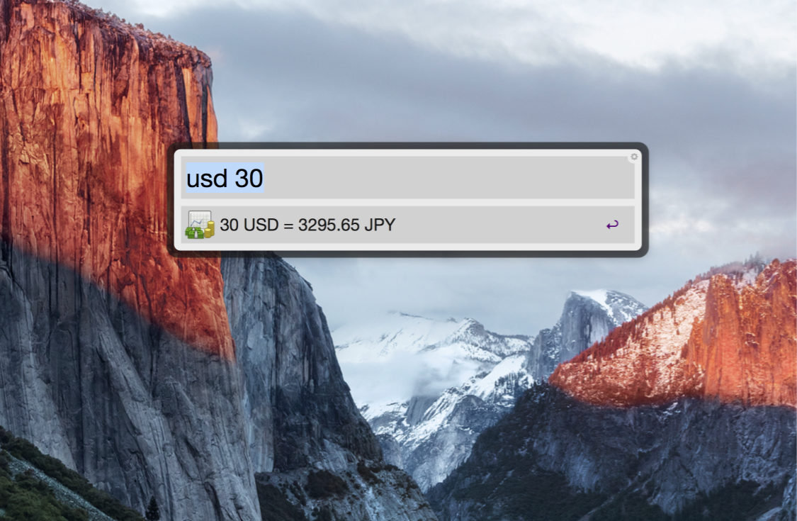

Currency Converter workflow for Alfred v2
====

## Environment

tested on Alfred v2, MacOS Sierra

## Usage

e.g. Typing `usd 30` shows the result as `3300 JPY`

But for now,  this tool only supports JPY from the USD and the EUR. Other conversion need to modify the script slightly.

## Install

Download zip and unzip it, then drag n' drop `Currency Converter Kai.alfredworkflow` file to the Workflows pane of the Alfred Preferences window.

## Author

This workflow is based on [this code](http://cl.ly/MBJ8) written by _John Doe_ at [CloudApp](https://www.getcloudapp.com/).

Thanks.
